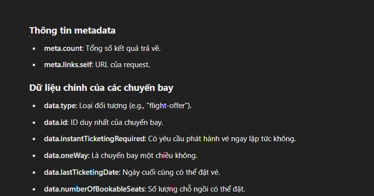
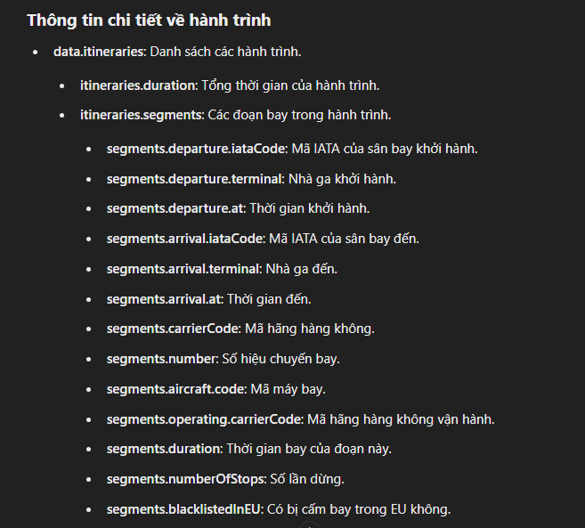
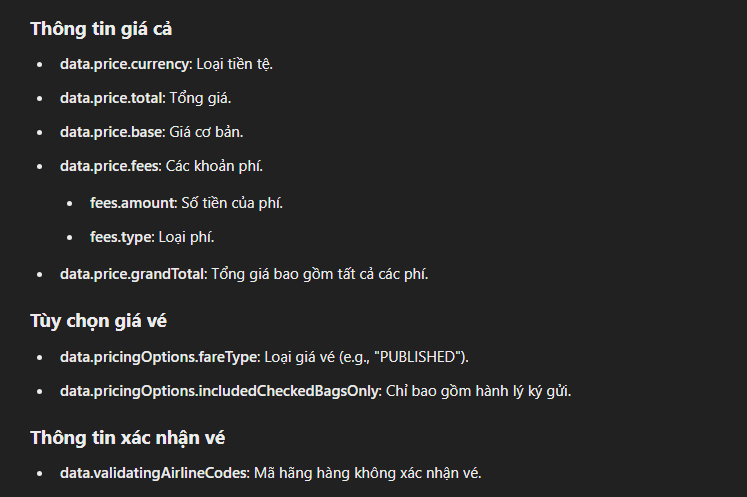
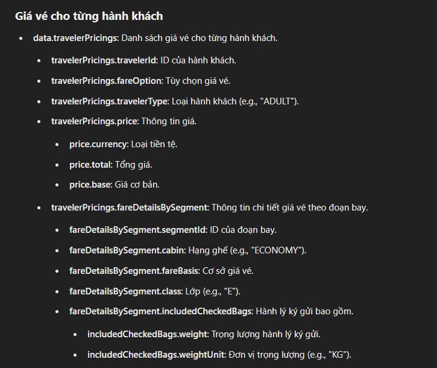
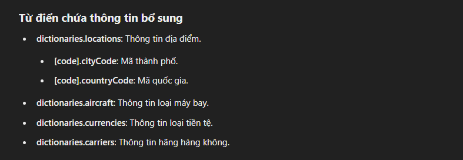

# sử dụng API của Amadeus

## Các package đã cài

- yarn add @tanstack/react-query
- yarn add @tanstack/react-query-devtools
- yarn add react-router-dom
- yarn add react-helmet-async
- yarn add react-toastify
- yarn add axios
- yarn add react-hook-form
- yarn add @hookform/resolvers yup
- yarn add firebase
- yarn add @floating-ui/react
- yarn add framer-motion
- yarn add react-transition-group - yarn add @types/react-transition-group
- yarn add rollup-plugin-visualizer
- yarn add immer

## ÔN TẬP KIẾN THỨC

- Tổng hợp hook đã xài

* useRoutes() - array router
* createSearchParams() - dùng để `tạo đường dẫn` cho các tham số truy vấn
* useSearchParams() - dùng để lấy các `tham số truy vấn` trên URL xuống (page, limit, ....)
* useParams() - dùng để lấy các `tham số định danh` trên URL xuống (id...)
* useNavigate() - vùa điều hướng trang - vừa lưu state
* useLocation() - xác định route hiện tại
* <Outlet/> chứa các component con - thuộc react router dom
* <Navigate> component điều hướng trang - thuộc react router dom
* useState()
* useEffect()
* useMemo(): khi chúng ta muốn một biến không bị làm mới lại mỗi lần component re-render. - nếu có thay đổi nó mới chạy lại - re-render
* useCallback(): khi chúng ta không muốn function của cta được khởi tạo lại mỗi lần component chúng ta re-render - nếu có thay đổi nó mới chạy lại - re-render
* forwardRef() - truyền ref vào component
* useRef() - truyền ref vào phần tử
* useQuery()
* useMutation()

- sử dụng setInterval và setTimeout nhớ clear nó đi

- dùng setValue của `react-hook-form` đảm bảo rằng giá trị của input được quản lý và cập nhật chính xác

- slice() và splice() trong mảng: đều cắt mảng

* slice(): cắt mảng, không thay đổi mảng gốc, tạo ra mảng mới
* splice(): cắt mảng, thay đổi mảng gốc

* Yc: là 1 chuỗi

- join() : nối chuỗi
- split(): tách chuỗi
- find(): tìm phần tử đầu tiên (thoa điều kiện)
---

1. Cái input file là uncontrolled component, nó không thể chuyển thành control component được.

2. Sự khác nhau giữa Uncontrol và Control là

Với uncontrol, em không thể truyền value vào cho nó theo kiểu value={this.fileInputValue}, vậy nên em không thể set giá trị khởi tạo cho cái input file ở trên được.

Với input text ở trên em có thể tạo cái state name = 'duoc', em f5 lại thì cái input có value là 'duoc' luôn. nhưng với input file thì không thể

Uncontrolled component thì không khởi tạo giá trị được như controlled component
-> nên dùng component Controller truyền control vào -> theo dõi value input dựa theo field.onChange
ví dụ là component selectDate và component Hạng vé khong cần value khởi tạo

---

## Firebase

- createUserWithEmailAndPassword() - hàm tạo tài khoản user email & password
- signInWithEmailAndPassword() - hàm đăng nhập user
- signInWithPopup() - hàm đăng nhập google (popup)

## API

### Flight booking

4. Flight Order Management API: Sau khi đã tạo thành công đơn đặt hàng, bạn có thể sử dụng API này để quản lý các đơn đặt hàng đã được tạo. Các chức năng bao gồm lấy thông tin chi tiết đơn hàng, cập nhật thông tin và hủy đơn hàng khi cần thiết.

6. Branded Fares Upsell API: Nếu bạn muốn cung cấp cho khách hàng các lựa chọn hạng vé khác nhau hoặc nâng cao giá trị bán hàng, bạn có thể sử dụng API này để bán các hạng vé thương hiệu (branded fares).

7. Flight Price Analysis API: API này có thể được sử dụng bất cứ lúc nào để phân tích giá cả của các chuyến bay, giúp bạn hiểu rõ hơn về các mẫu giá và xu hướng giá cả.

8. Flight Choice Prediction API: Nếu bạn muốn cung cấp các đề xuất chuyến bay dựa trên dữ liệu lịch sử và hành vi của khách hàng, bạn có thể sử dụng API này để dự đoán các lựa chọn chuyến bay phù hợp.

### Lỗi tồn động :

-

#### Đã fix lỗi 404 page khi deploy vercel (file vercel.json)

#### Dùng react.memo() để fix tình trạng component chung re-render khi không cần thiết
